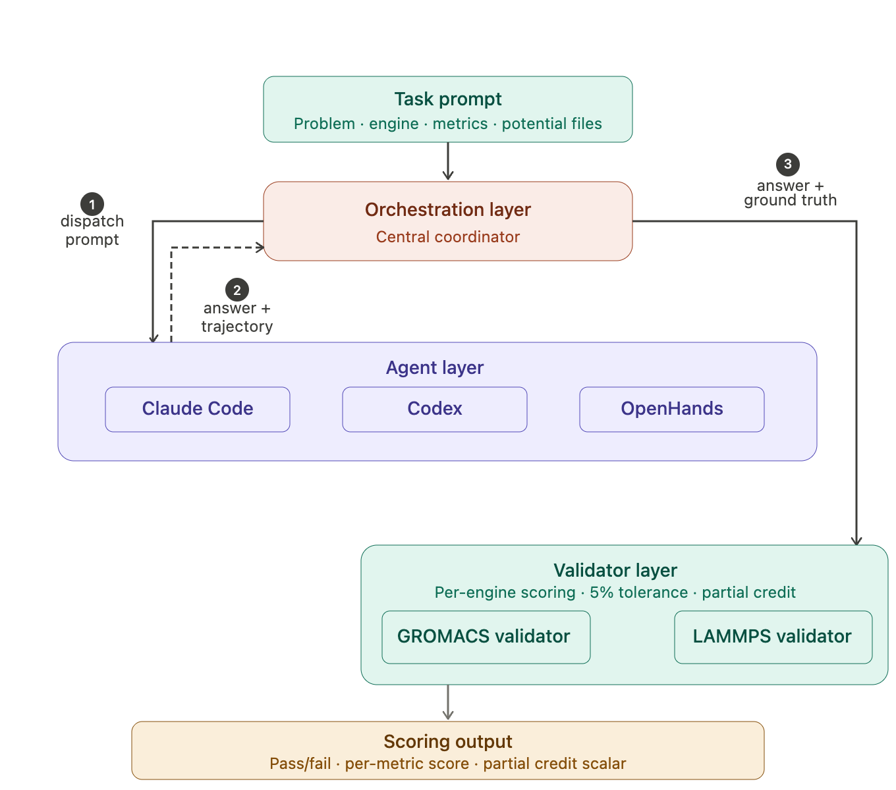

# MDGYM: Benchmarking AI Agents on Molecular Simulations

<div align="center">


📄 [Paper](https://arxiv.org/pdf/2605.08941)

</div>

MDGYM is a benchmark for evaluating AI agents on molecular dynamics (MD) simulation
tasks. Each task gives an agent a natural-language problem description — a system to
build, a set of simulation parameters, and a physical property to compute — and asks
it to produce a numeric result that is checked against a held-out ground truth.

## Dataset 

Tasks are organized by simulation engine:

| Engine  | Tasks |
|---------|-------|
| GROMACS | 75   |
| LAMMPS  | 99    | 
| **Total** | **174** |

## Leaderboard 🏆

| Rank | Model | Harness | Easy | Medium | Hard | Overall |
|------|-------|---------|------|--------|------|---------|
|1	| Claude Opus 4.8	| OpenHands	| 68.4%	| 34.5%	| 24.6% | 52.3% |
|2	| DeepSeek-V4 Pro	| OpenHands	| 43.9%	| 20.0%	| 8.8% | 24.2% |
|3	| GPT-OSS 20B	| OpenHands	| 0%	| 0%	| 0% | 0% |
|4	| Qwen3-Coder	| OpenHands	| 2%	| 0%	| 0% | 0% |

## Architecture
<div align="center">

</div>

## Usage

### Running the benchmark

Solve a single problem:

```bash
python main.py '{"id":"npt","problem_description":"NPT ensemble of Al at 300K","metrics":["temperature","pressure"],"ground_truth":{"temperature":"300","pressure":"1"}}' \
  --agent claude_code --engine lammps
```

Run a full task set (batch mode):

```bash
python main.py --input-dir data/GROMACS --agent claude_code --engine gromacs
python main.py --input-dir data/LAMMPS  --agent claude_code --engine lammps
```

Useful flags: `--agent {claude_code,codex,gemini,openhands}`, `--engine {lammps,gromacs}`,
`--session-id` (resumable batch runs), `--timeout`, `--inter-problem-delay`,
`--script-dir` (post-processing mode against pre-run simulation files), `--log-level`.
Run `python main.py --help` for the full reference.

Each problem's output — generated scripts, logs, `final_answer.json`, and
`trajectory_log.json` — is written to `working_directory/<problem_id>/` in
single-problem mode, or `working_directory/<session_id>/<problem_id>/` in batch
mode, alongside a `results.csv` summary of scores per problem for the session.

### Adding a new agent

Agents live in `md_simulation_interface/agents/` and implement `BaseAgent`
(`agents/base_agent.py`).

1. Add a value to the `AgentType` enum in `agents/base_agent.py`.
2. Create `agents/my_agent.py` with a class that subclasses `BaseAgent` and
   implements `get_agent_type()`, `execute(prompt, working_dir, timeout, engine)`,
   and `run_command(command, working_dir, log_file, timeout)`. See
   `agents/claude_agent.py` for a minimal reference implementation.
3. Register the class in `_agent_registry` in `agents/factory.py` (or call
   `AgentFactory.register_agent(...)` at runtime).
4. Add the new agent name to the `--agent` choices in `main.py`, and, if it
   needs a CLI path or default timeout, an entry under `agents` in
   `config.py`'s `DEFAULT_CONFIG`.

### Adding new validation

Validators check an agent's `final_answer.json` against a task's `ground_truth`
and return a `ValidationResult` (pass/fail plus a 0–1 `score`). They live in
`md_simulation_interface/validators/` and implement `BaseValidator`
(`validators/base_validator.py`).

1. Create `validators/my_validator.py` with a class that subclasses
   `BaseValidator` and implements `get_engine()` and
   `validate(output, working_dir, ground_truth)`. Reuse the base class's
   `_validate_ground_truth()` (numeric comparison within a relative tolerance)
   and `_calculate_score()` helpers where the default behavior applies — see
   `validators/gromacs_validator.py` or `validators/lammps_validator.py` for
   reference.
2. Register the class in `_validator_registry` in `validators/factory.py` (or
   call `ValidatorFactory.register_validator(...)` at runtime).
3. If the validator targets a new simulation engine, add it to the `MDEngine`
   enum in `models/problem.py` and to the `--engine` choices in `main.py`.

### Submitting to the leaderboard

Run your model/harness on the dataset and write us at vinay.kumar@scai.iitd.ac.in, krishan@iitd.ac.in and mausam@iitd.ac.in. We will evaluate your submission against the held-out ground truth values.

## Citation

If you use MDGYM in your work, please cite:

```
Kumar, Vinay, Satyendra Rajput, and N. M. Krishnan. "MDGYM: Benchmarking AI Agents on
Molecular Simulations." ArXiv, (2026). Accessed September 10, 2026.
https://arxiv.org/abs/2605.08941.
```
